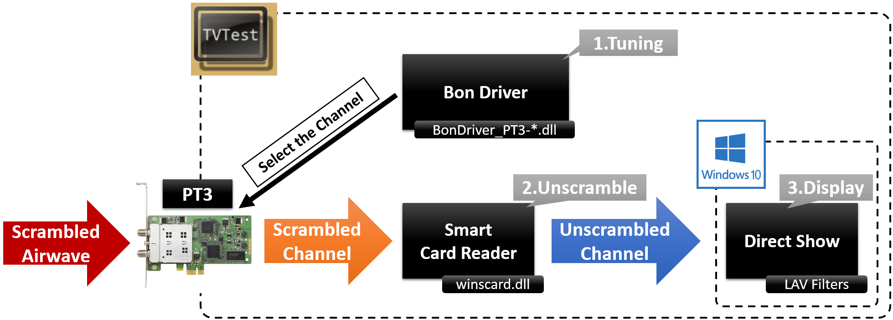
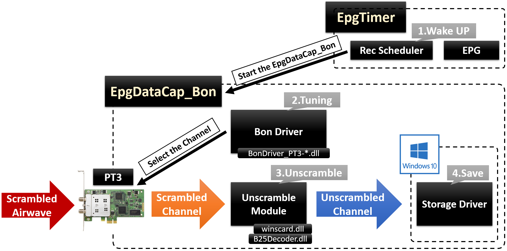
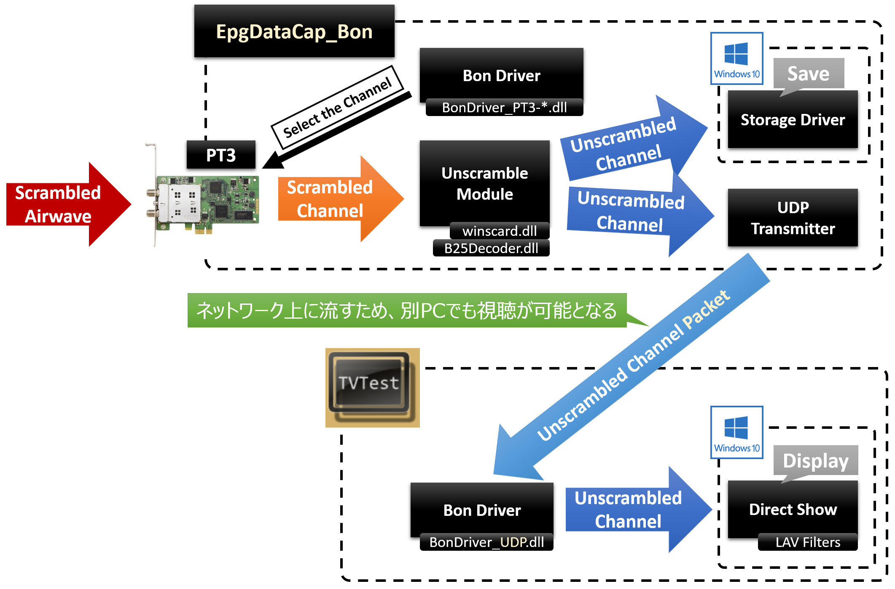

# 1. はじめに
本資料は以下の4点を行うためのツール類の**概要**を理解するための資料である。

1. PT3でリアルタイム視聴する
2. PT3で録画をする
3. PT3で録画をしつつリアルタイムでも再生する
4. ネットワーク経由で録画・再生をする

なお、本資料では細かな点については述べない。詳細は各自がWebで検索すること。
また、前提として [PT3公式サイト](http://earthsoft.jp/PT3/download.html) から入手できるドライバ・ソフトウェア類はインストール済みとする。

# 2. 更新履歴
* 2016/02/15：初版作成中

# 3. PT3でリアルタイム視聴する

## 3.1. 信号の流れ
リアルタイム視聴時に放送用の電波がどのようにデコードされるかを下図に示す。



## 3.2. 各モジュールの役割

各モジュールの役割を下表に示す。

| モジュール名   | 役割                     | 備考                            |
|:---------------|:-------------------------|:--------------------------------|
| TV Test        | TV視聴アプリの役割を果たす | - |
| PT3            | 放送波を受けるだけ       | PT3自身は復号化の機能を有さない |
| Bon Driver     | チューニングを行う | 地上/BS/CS に対応 |
| Smart Card Reader | スクランブルを解除する | winscard.dll を使うと B-C○Sカードが不要に！？ |
| Direct Show    | 動画のデコードや表示を担当する | [この記事](http://marupeke296.com/DSW_No3_BasicOfDirectShow.html) が参考になる…？|

# 4. PT3で予約録画する

## 4.1. 信号の流れ
録画予約時の信号の流れを下図に示す。



## 4.2. 各モジュールの役割
各モジュールの役割を下表に示す。

| モジュール名   | 役割                     | 備考                            |
|:---------------|:-------------------------|:--------------------------------|
| EpgTimer       | EPGで予約する。時間が来たらEDCBを起動する。 | EDCB は EpgDataCap_Bon の略称 |
| PT3            | 放送波を受けるだけ       | PT3自身は復号化の機能を有さない |
| Bon Driver     | チューニングを行う | 地上/BS/CS に対応 |
| Unscramble Module | スクランブルを解除する | B25Decoder.dll が必要なことに注意 |
| Strage Driver  | HDD やら SSD にデータを保存 | - |

# 5. PT3で録画しながら視聴する

## 5.1. 信号の流れ
録画しながら視聴する場合の信号の流れを下図に示す。EDCB(EpgDataCap_Bon) の UDP Transmitter(dllは無かったので本体に内蔵？) により
ネットワークに配信された Unscrambled Channel(スクランブル解除されたTSストリーム) を TVTest が受けることで録画と視聴が同時に出来る。



## 5.2. 各モジュールの役割
各モジュールの役割を下表に示す。

| モジュール名   | 役割                     | 備考                            |
|:---------------|:-------------------------|:--------------------------------|
| UDP Transmitter | ストリームをネットワーク上にUDPパケットとして流す | ネットワーク上の任意の機器に映像ストリームの送信が可能に！ |
| BonDriver_UDP.dll | PT3から信号を受ける様にUDPから信号を受ける | ネットワーク上の任意の機器から映像ストリームの受信が可能に！ |


# CMカット
長期保存する場合、CMを含んでいるとストレージを不必要に圧迫する。そこでCMカットを行う。

## マニュアルのCMカット
AviUtil を使う。やり方はそのうち調べる。

## 自動のCMカット

### 概要
以下の3つのソフトを組み合わせて実現する
* [comskip](http://www.kaashoek.com/comskip/) 、フリーウェアのCM位置検出ソフト
* [ComskipBatch.py](https://github.com/toru-ver4/kanri/mater/tv_rec/ComskipBatch.py) 、comskip で検出した情報を元に、実際にCMをカットする自作スクリプト
* [ffmpeg](http://ffmpeg.zeranoe.com/builds/) 、同じみのエンコードソフト。今回は ts ファイルの切り貼りに使う

### 準備
以下の通りに各種ファイルを置く。
```
REC_ROOT_DIR
│  
│  201602210830010102-aaa.ts
│  201602221700000102-bbb.ts
│  201602231729000102-ccc.ts
│  
├─cm_cut_ng(directory)
├─cm_cut_ok(directory)
│      
└─comskip_batch(directory)
   │  ComskipBatch.py
   │  
   ├─comskip(directory)
   │  comskip.exe
   │  comskip.ini
   │  etc, ...
   │      
   └─ffmpeg(directory)
       │  
       └─bin(directory)
           ffmpeg.exe

```

### やり方
REC_ROOT_DIR で以下のようにコマンドを打つ。

```
> python comskip_batch\ComskipBatch.py "201602210830010102-aaa.ts"
```

# TSファイルのエンコードについて
TSファイルはそのままだとファイルサイズが大きいので、H264/H265(HEVC)でエンコードを行う。<br>

## エンコードパラメータ
推奨するエンコードパラメータは以下の通り。

```
> ffmpeg -i input.ts -f mp4 -c:v libx264 -preset veryslow -crf 24 -vf dejudder,fps=30000/1001,fieldmatch,yadif,decimate,hqdn3d,unsharp=la=0.4 -tune animation -r 24000/1001 -s 1920x1080 -ac 2 -c:a ac3 -b:a 128k out.mp4
```

| パラメータ | 役割                     | 備考                            |
|:---------------|:-------------------------|:--------------------------------|
| preset | エンコード速度とファイルサイズのバランスを決める<br>パラメータ。今回の設定では画質とは無関係。 | 固定ビットレートの場合は画質と関係あり |
| fieldmatch | 逆テレシネ変換が出来るように、<br>フィールドの並べ替えを行うフィルタ | 下の補足説明参照。 |
| yadif | デインターレースするフィルタ | 下の補足説明参照。 |
| decimate | 重複フレームを削除するフィルタ | 下の補足説明参照。 |
| hqdn3d | ノイズ除去フィルタ | 地デジ特有の粒子状ノイズを軽減する |
| unsharp | 画像先鋭化 | エンコードするとボケた感じになるので… |
| nnedi | デインターレースなど | 速度は遅いが品質は最高 |

### 逆テレシネ変換の補足
```
# Original 24fps source
  Frame:          1 2 3 4     <-- 24p

# TV Source             
  Top fields:     1 2 2 3 4   <-- 60i
  Bottom fields:  1 2 3 4 4   <-- 60i
                  o o x x o

  x : Top and Bottom is not match.

# Apply the "fieldmatch" filter
  Top fields:     1 2 2 3 4   <-- 60i
  Bottom fields:  1 2 2 3 4   <-- 60i

# Apply the "yadif" filter =
  Frame:          1 2 2 3 4   <-- 30p

# Apply the "decimate" filter =
  Frame:          1 2 3 4     <-- 24p

```

# ffmpeg の build
CPUでエンコードすると時間がかかって仕方ないので、H/W Encoder を導入する。
H/W Encoder を組み込んだ ffmpeg は再配布禁止なので自前でコンパイルする。
Windows上に環境を構築するのは時間がかかるので、今回は Linux 上で Wiondows バイナリをクロスコンパイルで作成する。

```bash:build.sh
# ツール類入れる
$ sudo apt-get update
$ sudo apt-get install gcc-mingw-w64-i686 g++-mingw-w64-i686 yasm make automake autoconf git \
  pkg-config libtool 

# ビルド用のディレクトリ作成
$ mkdir ~/local/src        # ソースコード置き場
$ mkdir ~/local/src/mingw  # クロスコンパイル用ツールチェイン置き場
$ mkdir ~/win32            # 生成バイナリ置き場

# ソースコードを取得
$ cd ~/local/src
$ git clone https://github.com/rdp/ffmpeg-windows-build-helpers.git
$ wget http://sourceforge.net/projects/lame/files/lame/3.99/lame-3.99.5.tar.gz
$ tar xvzf lame-3.99.5.tar.gz
$ wget http://downloads.sourceforge.net/faac/faac-1.28.tar.gz
$ tar xvzf faac-1.28.tar.gz
$ git clone http://git.videolan.org/git/x264.git x264
$ wget wget https://developer.nvidia.com/video-sdk-601
$ mv video-sdk-601 nvidia_video_sdk_6.0.1.zip
$ unzip nvidia_video_sdk_6.0.1.zip
$ git clone https://github.com/lu-zero/mfx_dispatch.git mfx_dispatch
$ git clone git://source.ffmpeg.org/ffmpeg.git ffmpeg

# クロスコンパイル用のツールチェインをビルド
$ cd ~/local/src/mingw
$ wget http://zeranoe.com/scripts/mingw_w64_build/mingw-w64-build-3.6.7
$ chmod 755 mingw-w64-build-3.6.7
$ ./mingw-w64-build-3.6.7
  ここで、何か色々と聞かれるけど、32bit版 オンリーにする以外は適当でOK(だと思う)。

# ツールチェインをパスに追加
$ export PATH="$HOME/local/src/mingw/mingw-w64-i686/bin:$PATH"

# 各種バイナリをコンパイル

$ cd ~/local/src/lame-3.99.5
$ wget https://gist.github.com/rdp/3581e2c51916f3d8056e/raw/052a1a57b876cc6f22f1c0780e71193641b11669/lame3.patch
$ patch < lame3.patch
$ ./configure --host=i686-w64-mingw32 --prefix=$HOME/win32 --enable-static --disable-shared
$ make 
$ make install

$ cd ~/local/src/faac-1.28
$ ./configure --host=i686-w64-mingw32 --prefix=$HOME/win32 --enable-static --disable-shared \
  --with-mp4v2=no
$ make 
$ make install

$ cd ~/local/src/x264
$ ./configure --host=i686-w64-mingw32 --cross-prefix=i686-w64-mingw32- --prefix=$HOME/win32
$ make
$ make install && make install-lib-dev && make install-lib-static

$ cd ~/local/src/nvidia_video_sdk_6.0.1/
$ cp Samples/common/inc/nvEncodeAPI.h ~/win32/include/

$ cd ~/local/src/mfx_dispatch
$ autoreconf -i
$ PKG_CONFIG_PATH="$HOME/win32/lib/pkgconfig" ./configure --host=i686-w64-mingw32 \
  --prefix=$HOME/win32 --disable-shared --enable-static
$ make 
$ make install

$ cd ~/local/src/ffmpeg
$ PKG_CONFIG_PATH="$HOME/win32/lib/pkgconfig" LDFLAGS="-L$HOME/win32/lib" \
  CFLAGS="-I$HOME/win32/include" ./configure --enable-nonfree --enable-gpl \
  --enable-memalign-hack --enable-libmp3lame --enable-libfaac --enable-nvenc \
  --enable-libx264 --enable-libmfx --arch=x86 --target-os=mingw32 \
  --cross-prefix=i686-w64-mingw32- --pkg-config=pkg-config --prefix=$HOME/win32
```

# スリープモードへの移行について
録画データのエンコードは夜間に行いたいが、Windowsはエンコード中にも平気でスリープモードへ移行してしまう。
そこでフリーウェアの [SleepTool](http://www.vector.co.jp/soft/winnt/util/se495541.html) を使う。

このソフトを使うと、CPU使用率やDiskアクセス量を監視してスリープするか判別してくれる。


# 各種バイナリ置き場
[ここ](http://up.mapopi.com/?pg=0)

リンク先は1ページ目。2ページ目以降もあることに注意。